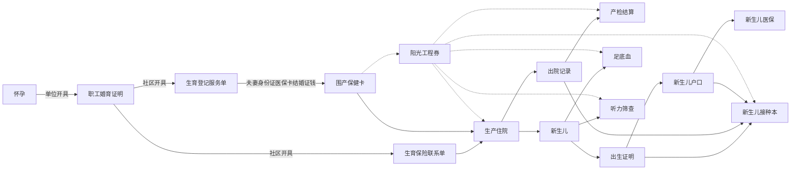

```mermaid
graph LR;
    怀孕--单位开具-->职工婚育证明;
    职工婚育证明--社区开具-->生育登记服务单;
    职工婚育证明--社区开具-->生育保险联系单;
    生育登记服务单--夫妻身份证医保卡结婚证钱-->围产保健卡;
    围产保健卡-.->阳光工程券;
    生育保险联系单-->生产住院;
    围产保健卡-->生产住院;
    阳光工程券-.->生产住院;
    生产住院-->出院记录;
    生产住院-->新生儿;
    出院记录-->产检结算;
    阳光工程券-.->产检结算;
    新生儿-->出生证明;
    新生儿-->足底血;
    阳光工程券-.->足底血;
    新生儿-->听力筛查;
    阳光工程券-.->听力筛查;
    出生证明-->新生儿户口;
    新生儿户口-->新生儿医保;
    出生证明-->新生儿接种本;
    出院记录-->新生儿接种本;
    新生儿户口-->新生儿接种本;
    阳光工程券-.->新生儿接种本;
```
